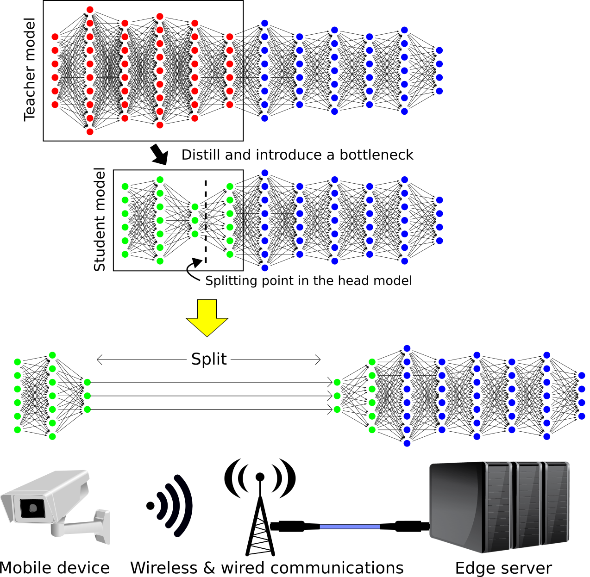

# Head Network Distillation for Split Computing

The official implementations of Head Network Distillation (HND) studies for image classification tasks:
- "Head Network Distillation: Splitting Distilled Deep Neural Networks for Resource-constrained Edge Computing Systems," [IEEE Access](https://ieeexplore.ieee.org/xpl/RecentIssue.jsp?punumber=6287639)  
[[PDF (Open Access)](https://ieeexplore.ieee.org/document/9265295)]  
- "Distilled Split Deep Neural Networks for Edge-assisted Real-time Systems," [MobiCom 2019 Workshop HotEdgeVideo '19](https://www.microsoft.com/en-us/research/event/the-1st-workshop-on-hot-topics-in-video-analytics-and-intelligent-edges/)  
[[PDF (Open Access)](https://dl.acm.org/doi/abs/10.1145/3349614.3356022)]

 

## Citations
```bibtex
@article{matsubara2020head,
  author={Matsubara, Yoshitomo and Callegaro, Davide and Baidya, Sabur and Levorato, Marco and Singh, Sameer},
  journal={IEEE Access}, 
  title={Head Network Distillation: Splitting Distilled Deep Neural Networks for Resource-Constrained Edge Computing Systems}, 
  year={2020},
  volume={8},
  number={},
  pages={212177-212193},
  doi={10.1109/ACCESS.2020.3039714}
}

@inproceedings{matsubara2019distilled,
  title={Distilled Split Deep Neural Networks for Edge-assisted Real-time Systems},
  author={Matsubara, Yoshitomo and Baidya, Sabur and Callegaro, Davide and Levorato, Marco and Singh, Sameer},
  booktitle={Proceedings of the 2019 Workshop on Hot Topics in Video Analytics and Intelligent Edges},
  pages={21--26},
  year={2019}
}
```

## Requirements
- Python 3.6
- pipenv
- [myutils](https://github.com/yoshitomo-matsubara/myutils)


## How to clone
```
git clone https://github.com/yoshitomo-matsubara/head-network-distillation.git
cd head-network-distillation/
git submodule init
git submodule update --recursive --remote
pipenv install
```


## Download datasets

### ILSVRC 2012 (ImageNet) dataset
```
# Go to home directory
mkdir ~/dataset/ilsvrc2012/{train,val} -p
mv ILSVRC2012_img_train.tar ~/dataset/ilsvrc2012/train/
cd ~/dataset/ilsvrc2012/train/
tar -xvf ILSVRC2012_img_train.tar
for f in *.tar; do
  d=`basename $f .tar`
  mkdir $d
  (cd $d && tar xf ../$f)
done
rm -r *.tar

mv ILSVRC2012_img_val.tar ~/dataset/ilsvrc2012/val/
wget https://raw.githubusercontent.com/soumith/imagenetloader.torch/master/valprep.sh
mv valpre.sh ~/dataset/ilsvrc2012/val/
cd ~/dataset/ilsvrc2012/val/
sh valpre.sh
```

```
# Go to the root of the repository
pipenv run python dataset_converter.py --input ~/dataset/ilsvrc2012/ --dataset imagenet --output ./resource/data/ILSVRC2012/
```

## Trained models
We publish bottleneck-injected DenseNet-169, -201, Resnet-152 and Inception-v3 trained on 
ILSVRC 2012 (a.k.a. ImageNet) dataset in the following three methods:
- [Naive training](https://drive.google.com/file/d/1yvFslgeewBsHx_GpSJd1MFEcbVTn_Ymq/view?usp=sharing)
- [Knowledge Distillation](https://drive.google.com/file/d/16Q6KxUXjgK5vCsQ5IGt5P1Z21FVAE54R/view?usp=sharing)
- [Head Network Distillation](https://drive.google.com/file/d/1EpTMxSGMU9tDUpEX3bIj_EXGskzAdZC_/view?usp=sharing)

Unzip the downloaded zip files under `./resource/ckpt/`, then there will be `./resource/ckpt/{naive,kd,hnd}/`.

## Test trained models

### Naive
```
# DenseNet-169
pipenv run python src/model_runner.py --config config/official/imagenet/naive/densenet169_head_mimic-ver2b-3ch.yaml -test_only
pipenv run python src/model_runner.py --config config/official/imagenet/naive/densenet169_head_mimic-ver2b-6ch.yaml -test_only
pipenv run python src/model_runner.py --config config/official/imagenet/naive/densenet169_head_mimic-ver2b-9ch.yaml -test_only
pipenv run python src/model_runner.py --config config/official/imagenet/naive/densenet169_head_mimic-ver2b-12ch.yaml -test_only

# DenseNet-201
pipenv run python src/model_runner.py --config config/official/imagenet/naive/densenet201_head_mimic-ver2b-3ch.yaml -test_only
pipenv run python src/model_runner.py --config config/official/imagenet/naive/densenet201_head_mimic-ver2b-6ch.yaml -test_only
pipenv run python src/model_runner.py --config config/official/imagenet/naive/densenet201_head_mimic-ver2b-9ch.yaml -test_only
pipenv run python src/model_runner.py --config config/official/imagenet/naive/densenet201_head_mimic-ver2b-12ch.yaml -test_only

# ResNet-152
pipenv run python src/model_runner.py --config config/official/imagenet/naive/resnet152_head_mimic-ver2b-3ch.yaml -test_only
pipenv run python src/model_runner.py --config config/official/imagenet/naive/resnet152_head_mimic-ver2b-6ch.yaml -test_only
pipenv run python src/model_runner.py --config config/official/imagenet/naive/resnet152_head_mimic-ver2b-9ch.yaml -test_only
pipenv run python src/model_runner.py --config config/official/imagenet/naive/resnet152_head_mimic-ver2b-12ch.yaml -test_only

# Inception-v3
pipenv run python src/model_runner.py --config config/official/imagenet/naive/inception_v3_head_mimic-ver1b-3ch.yaml -test_only
pipenv run python src/model_runner.py --config config/official/imagenet/naive/inception_v3_head_mimic-ver1b-6ch.yaml -test_only
pipenv run python src/model_runner.py --config config/official/imagenet/naive/inception_v3_head_mimic-ver1b-9ch.yaml -test_only
pipenv run python src/model_runner.py --config config/official/imagenet/naive/inception_v3_head_mimic-ver1b-12ch.yaml -test_only
```

### KD
```
# DenseNet-169
pipenv run python src/model_distiller.py --config config/official/imagenet/kd/densenet169_head_mimic-ver2b-3ch.yaml -test_only
pipenv run python src/model_distiller.py --config config/official/imagenet/kd/densenet169_head_mimic-ver2b-6ch.yaml -test_only -student_only
pipenv run python src/model_distiller.py --config config/official/imagenet/kd/densenet169_head_mimic-ver2b-9ch.yaml -test_only -student_only
pipenv run python src/model_distiller.py --config config/official/imagenet/kd/densenet169_head_mimic-ver2b-12ch.yaml -test_only -student_only

# DenseNet-201
pipenv run python src/model_distiller.py --config config/official/imagenet/kd/densenet201_head_mimic-ver2b-3ch.yaml -test_only
pipenv run python src/model_distiller.py --config config/official/imagenet/kd/densenet201_head_mimic-ver2b-6ch.yaml -test_only -student_only
pipenv run python src/model_distiller.py --config config/official/imagenet/kd/densenet201_head_mimic-ver2b-9ch.yaml -test_only -student_only
pipenv run python src/model_distiller.py --config config/official/imagenet/kd/densenet201_head_mimic-ver2b-12ch.yaml -test_only -student_only

# ResNet-152
pipenv run python src/model_distiller.py --config config/official/imagenet/kd/resnet152_head_mimic-ver2b-3ch.yaml -test_only
pipenv run python src/model_distiller.py --config config/official/imagenet/kd/resnet152_head_mimic-ver2b-6ch.yaml -test_only -student_only
pipenv run python src/model_distiller.py --config config/official/imagenet/kd/resnet152_head_mimic-ver2b-9ch.yaml -test_only -student_only
pipenv run python src/model_distiller.py --config config/official/imagenet/kd/resnet152_head_mimic-ver2b-12ch.yaml -test_only -student_only

# Inception-v3
pipenv run python src/model_distiller.py --config config/official/imagenet/kd/inception_v3_head_mimic-ver1b-3ch.yaml -test_only
pipenv run python src/model_distiller.py --config config/official/imagenet/kd/inception_v3_head_mimic-ver1b-6ch.yaml -test_only -student_only
pipenv run python src/model_distiller.py --config config/official/imagenet/kd/inception_v3_head_mimic-ver1b-9ch.yaml -test_only -student_only
pipenv run python src/model_distiller.py --config config/official/imagenet/kd/inception_v3_head_mimic-ver1b-12ch.yaml -test_only -student_only
```

### HND
```
# DenseNet-169
pipenv run python src/mimic_runner.py --config config/official/imagenet/hnd/densenet169_head_mimic-ver2b-3ch.yaml -test_only
pipenv run python src/mimic_runner.py --config config/official/imagenet/hnd/densenet169_head_mimic-ver2b-6ch.yaml -test_only -student_only
pipenv run python src/mimic_runner.py --config config/official/imagenet/hnd/densenet169_head_mimic-ver2b-9ch.yaml -test_only -student_only
pipenv run python src/mimic_runner.py --config config/official/imagenet/hnd/densenet169_head_mimic-ver2b-12ch.yaml -test_only -student_only

# DenseNet-201
pipenv run python src/mimic_runner.py --config config/official/imagenet/hnd/densenet201_head_mimic-ver2b-3ch.yaml -test_only
pipenv run python src/mimic_runner.py --config config/official/imagenet/hnd/densenet201_head_mimic-ver2b-6ch.yaml -test_only -student_only
pipenv run python src/mimic_runner.py --config config/official/imagenet/hnd/densenet201_head_mimic-ver2b-9ch.yaml -test_only -student_only
pipenv run python src/mimic_runner.py --config config/official/imagenet/hnd/densenet201_head_mimic-ver2b-12ch.yaml -test_only -student_only

# ResNet-152
pipenv run python src/mimic_runner.py --config config/official/imagenet/hnd/resnet152_head_mimic-ver2b-3ch.yaml -test_only
pipenv run python src/mimic_runner.py --config config/official/imagenet/hnd/resnet152_head_mimic-ver2b-6ch.yaml -test_only -student_only
pipenv run python src/mimic_runner.py --config config/official/imagenet/hnd/resnet152_head_mimic-ver2b-9ch.yaml -test_only -student_only
pipenv run python src/mimic_runner.py --config config/official/imagenet/hnd/resnet152_head_mimic-ver2b-12ch.yaml -test_only -student_only

# Inception-v3
pipenv run python src/mimic_runner.py --config config/official/imagenet/hnd/inception_v3_head_mimic-ver1b-3ch.yaml -test_only
pipenv run python src/mimic_runner.py --config config/official/imagenet/hnd/inception_v3_head_mimic-ver1b-6ch.yaml -test_only -student_only
pipenv run python src/mimic_runner.py --config config/official/imagenet/hnd/inception_v3_head_mimic-ver1b-9ch.yaml -test_only -student_only
pipenv run python src/mimic_runner.py --config config/official/imagenet/hnd/inception_v3_head_mimic-ver1b-12ch.yaml -test_only -student_only
```

## Train models
If you would like to train models, you should exclude `-test_only` from the above commands, and set new file paths for student model in the yaml files.  
To enable the distributed training mode, you should use `pipenv run python -m torch.distributed.launch --nproc_per_node=${NUM_GPUS} --use_env ONE_OF_THE_ABOVE_THREE.py  ... --world_size ${NUM_GPUS}`
